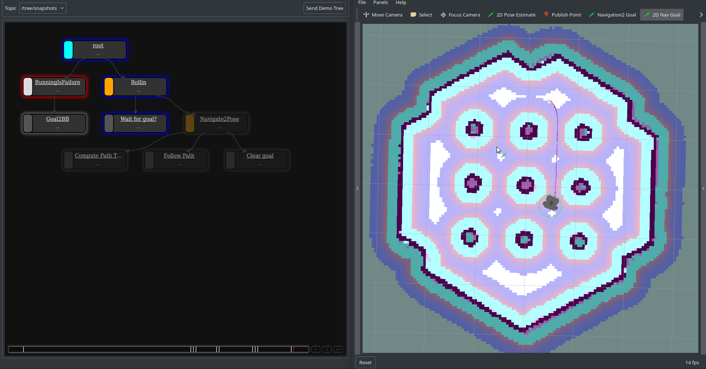

# Nav2 Trees

Behaviour Trees written using [py_trees](https://github.com/splintered-reality/py_trees) for [navigation2](https://github.com/ros-planning/navigation2).

# Usage

* See [nav2_bringup](https://github.com/ros-planning/navigation2/tree/master/nav2_bringup) for pre-requisites and launching navigation2. Branch `dashing-devel` is used.
* Run `ros2 run nav2_trees simple`.
* Localize the robot using `2D Pose Estimate` tool in rviz.
* Set the goal in rviz using `2D Nav goal` (Set Goal Tool).
* (Optional) run `py-trees-tree-watcher` or `py-trees-tree-viewer` to visualize the tree

